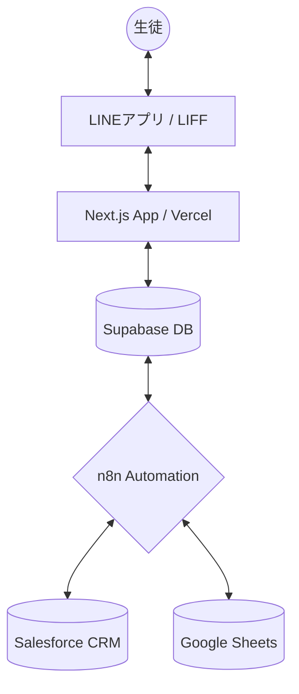

# **EI Student Platform - 実装計画書 (Implementation Plan v1.7)**

## **1. エグゼクティブサマリー**

### **1.1. プロジェクト目的**
イングリッシュイノベーションズ（EI）の生徒向けに、公式LINEを通じた利便性の高い「マイページ」を提供します。LINE ID（LIFF）をキーとしたシームレスな体験により、生徒は学習進捗の確認や、Vacation（休暇）・休学等の各種申請を数タップで完結できるようになります。これにより、生徒のエンゲージメント向上と、校舎スタッフの事務負担（ゼロ・アドミ）を同時に実現します。

### **1.2. コア・バリュー**
- **UXの極大化**: ログイン不要、LINEリッチメニューからのダイレクトアクセス。
- **データの一元化**: Salesforce、Supabase、LINEを常時同期。
- **インテリジェントな自動化**: School Break期間の自動判定や受講終了日の自動計算。

---

## **2. システムアーキテクチャ**

### **2.1. 技術スタック**
- **Frontend**: Next.js (App Router), TypeScript, Tailwind CSS
- **UI Components**: shadcn/ui, Radix UI, Lucide React
- **Auth/Backend**: LINE Front-end Framework (LIFF), Supabase
- **Data Synchronization**: n8n (iPaaS), Salesforce, Google Sheets
- **Deployment**: Vercel

### **2.2. データフロー図**

---

## **3. 実装済み機能 (v1.0 - v1.1)**

### **3.1. 認証 & プロフィール管理**
- **LIFF Auth (`hooks/use-liff-auth.ts`)**: 
    - LINE User IDを取得し、Supabaseの `leads` と `students` テーブルを順番に照合。
    - 取得元に応じた `isLead` フラグを返し、アプリケーション全体でユーザー属性を即座に判別可能。
    - **ディープリンク対応**: `liff.login` 時の `redirectUri` 制御により、直接リンクからの遷移でもパスを維持。
    - ローカル開発用のダミーデータフォールバック機能を完備。
- **集中データ管理 (`hooks/use-student-data.ts`)**:
    - 生徒のプロフィール、現在受講中の契約コース、学習履歴を効率的にフェッチ。

### **3.2. ステータス連動型自動リダイレクト (`app/page.tsx`)**
- **役割の変更**: TOPページをダッシュボード表示から、ステータスに応じた**自動リダイレクト・ハブ**へと変更。
- **リダイレクト判定**: 
    - `isLead` が `false` (既存生徒) -> `/vacation` (既存生徒の最頻用ページ)
    - `isLead` が `true` (リード) -> `/counseling-form` (事前アンケート)
- **UI非表示による安全性**: リダイレクト判定中はロゴとローディングのみを表示し、個人情報や学習状況のフラッシュ（一瞬の表示）を完全に防止。

### **3.3. セルフサービス申請システム**
- **Vacation申請 (`/vacation`)**: 
    - 最大3週間の短期欠席に対応。
- **休学申請 (`/leave`)**: 
    - 4週間以上の長期欠席に対応。
    - 支払い方法（振込・カード等）の選択機能を搭載。
- **Vacation申請/休学申請のSB判定ロジック（School Break自動除外・計算）**:
    - **データの取得**: `school_breaks` テーブルより、年間の休校期間をマスターとしてフェッチ。
    - **選択肢の動的制御**: 
        - 申請の開始日（月曜）および終了日（日曜）の選択肢を生成する際、SB期間に重なる日付を自動的にフィルタリング。
    - **週数・延長計算**:
        - 申請期間内の「月曜日」の数をカウントし、そのうちSB期間と重複する月曜日の数を `sb_weeks` として算出。
        - 総週数から `sb_weeks` を差し引いた `effective_weeks`（実質週数）を決定。
        - 生徒の現在の受講終了日に `effective_weeks` 分を加算し、将来の終了日 (`new_end_date`) を自動計算する。
- **カウンセリングアンケート (`/counseling-form`)**: 
    - 来校前の事前アンケート。
    - `counseling_form_settings` に基づく動的フィールド生成。

### **3.4. 運用のレジリエンス強化 (v1.2)**
- **エラー画面の高度化とGoogleフォーム誘導**:
    - LINEの登録情報が見つからない場合のエラーUIを刷新（`shadcn/ui Alert`を活用）。
    - 認証エラー発生時でも運用が止まらないよう、各申請種別に応じたGoogleフォームへの代替導線（ボタン）を実装。
    - カウンセリング、Vacation、休学のそれぞれの目的に最適化されたフォームURLを自動的に出し分け。

### **3.5. UI/UX 精緻化 (v1.3)**
- **テキストのはみ出し防止 (Truncation Logic)**:
    - コース名や日付、支払い方法などの長いテキストが UI を破壊しないよう、全ての `SelectTrigger` と `SelectValue` に `truncate` および `overflow-hidden` を適用。
- **インテリジェントな表示ロジック**:
    - `Select` コンポーネントにおいて、内部的な ID（`sf_id` 等）をユーザーに表示せず、常に人間が判読可能な名称（`course_name` 等）が表示されるようロジックを最適化。
- **デバッグログの徹底排除**:
    - 本番環境でのパフォーマンスとセキュリティを考慮し、データフェッチ層のデバッグログをクリーンアップ。

### **3.6. Vacation 申請 UX の高度化 (v1.4)**
- **動的延長リマインド機能**:
    - 申請期間の選択と連動し、「何週間コースが延長されるか」をリアルタイムでフォーム上に表示。
- **連続申請サポート**:
    - 複数コース受講者がストレスなく申請を完了できるよう、完了画面から再度申請フォームへ戻る「続けて別のコースも申請する」導線を追加。

### **3.7. Vacation 申請 UI の統合・洗練 (v1.5)**
- **サマリーカードの導入**:
    - 重複していた延長アラートと期間表示ボックスを、1つの視認性の高いカード UI に統合。
    - 「何週間休むか（申請期間）」をメインとし、その結果「いつまで延長されるか」を補足として配置する階層構造を採用。
- **ビジュアル・ブラッシュアップ**:
    - `shadcn/ui` のトーンに合わせた清潔感のある青ベースのカードデザイン、アイコン活用、およびアニメーション (`animate-in`) を適用。

### **3.8. 申請テーブルの分割とID設計の統一 (v1.6)**
- **テーブルの専門化**:
    - 運用上の簡略化と n8n 連携の最適化のため、`requests` テーブルを `vacation_requests` と `leave_requests` に分割。
- **Salesforce ID への完全移行**:
    - UUID ベースの `user_id` を廃止。`student_sf_id` および `contract_course_sf_id` を主軸とした Salesforce 連携基盤に統一。
- **データベース命名規則の最終統一 (v1.7 黄金規則)**:
    - データの透明性を高め、ビルドエラーを完全に解消するために、全テーブルのカラム名を統一。
    - LINE ID ➔ `line_id`, 生徒ID ➔ `student_sf_id`, リードID ➔ `lead_sf_id`, 契約コースID ➔ `contract_course_sf_id`。
    - `src/types/database.ts` および全コンポーネント、フックの型同期を完了。

---

## **4. データベース設計 (Supabase)**

| テーブル名 | 用途 | 主要カラム |
| :--- | :--- | :--- |
| `leads` | 見込み客マスター | `line_id` (PK), `lead_sf_id`, `status`, `campus`, `course`, `level`, `purpose` |
| `students` | 既存生徒マスター | `line_id` (PK), `student_sf_id`, `status`, `campus`, `target_score`, `starting_score`, `current_course_end_date` |
| `contract_courses` | 契約コース情報 | `contract_course_sf_id` (PK), `student_sf_id`, `course_name`, `status`, `end_date`, `start_date`, `campus`, `line_id`, `student_name` |
| `vacation_requests` | Vacation申請ログ | `line_id`, `contract_course_sf_id`, `student_sf_id`, `start_date`, `end_date`, `effective_weeks`, `new_end_date`, `status`, `sb_weeks` |
| `leave_requests` | 休学申請ログ | `line_id`, `contract_course_sf_id`, `student_sf_id`, `start_date`, `end_date`, `payment_method`, `status`, `sb_weeks` |
| `counseling_forms` | アンケート回答 | `line_id`, `student_sf_id`, `lead_sf_id`, `details`, `status` |
| `school_breaks` | 休校期間マスタ | `start_date`, `end_date`, `name` |
| `counseling_form_settings` | フォーム構成 | `field_id` (PK), `field_type`, `label`, `options`, `is_required` |

---

## **5. フェーズ別実装ロードマップ**

### ✅ **Phase 1: 基盤構築 (完了)**
- [x] Next.js 開発環境および Supabase インフラ構築。
- [x] LIFF SDK 統合と LINE ID による認証フロー。
- [x] 生徒データ表示用ダッシュボードのプロトタイプ。

### ✅ **Phase 2: ビジネスロジック実装 (完了)**
- [x] Vacation/休学申請フォームの開発。
- [x] School Break 自動除外ロジックの実装。
- [x] IDベースの Salesforce データ紐付け (`sf_id` への移行)。
- [x] `/success` ページの実装と LIFF ウィンドウ自動クローズ。

### 🚀 **Phase 3: 拡張 & 本番稼働 (完了・安定化)**
- [x] **メタデータ・OGP最適化**: 各ページの日本語タイトル・説明文の個別設定。
- [x] **Vercel デプロイメント**: プロダクション環境への移行と疎通テスト。
- [x] **TOPページの自動リダイレクト化**: ステータス連動型遷移の実装とUIのシンプル化。
- [x] **運用のレジリエンス強化**: 認証エラー時の Google フォーム代替導線の実装。
- [x] **テーブル設計の最適化 (v1.3)**: `students` テーブルを `leads` と `students` に分割し、Salesforce の設計に準拠。
- [x] **Salesforce 同期ロジックの刷新**: HTTP Callout (UPSERT) への対応と RLS ポリシーの調整。
- [x] **取得ロジックの優先順位付け**: `useStudentData` における既存生徒優先フェッチの実装。
- [x] **データベース命名規則の最終統一 (v1.7 黄金規則)**: 全テーブルのカラム名および型定義の一貫性を確保。

### 📅 **Phase 4: 将来的な拡張性**
- [ ] **プッシュ通知統合**: 申請承認時の LINE Messaging API 連携。
- [ ] **教材ダウンロード**: 受講コースに紐づいたPDF/音源へのアクセス提供。
- [ ] **RLS ポリシーの厳格化**: 本番環境に向けた Supabase セキュリティの最終精査。
- [ ] **パフォーマンス最適化**: 画像アセットの最適化、APIレスポンスの高速化。

---

## **6. 開発ガイドライン**

### **6.1. 設計原則**
- **Aesthetics First**: ユーザーを惹きつける、モダンなダーク/グラスモーフィズムデザイン。
- **Stability**: 外部 API（LINE/Salesforce）のダウンを想定したレジリエンス（回復力）の確保。
- **Single Source of Truth**: データ更新は原則 Salesforce をオリジンとし、n8n で Supabase を同期。

### **6.2. 運用ルール**
- 環境変数は `.env.local` で管理（Git 除外）。Vercel 上で本番用キーを設定。
- Zod によるフロントエンドバリデーションと、Supabase RLS によるバックエンドガードの二重化。
- 申請フローの変更時は、必ず `ProjectPlan.md` および `SPECIFICATION.md` を更新すること。
