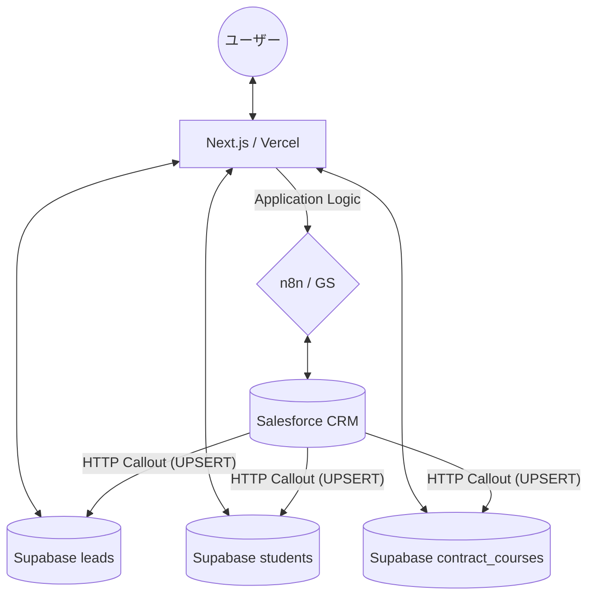

---

# **プロジェクト仕様書 - EI Student Platform (v1.6)**

## **1. プロジェクト概要**

### **1.1. プロジェクト名**
**EI Student Platform**（通称：生徒マイページ）

### **1.2. ビジョン**
イングリッシュイノベーションズの生徒が、日常的に利用するLINEを通じて**「自分の成長を実感し、あらゆる手続きをノンストレスで完結できる」**環境を構築する。

### **1.3. ミッション**
* **ゼロ・アドミ（事務ゼロ）の実現**: 休学・Vacation等の申請をセルフサービス化し、校舎スタッフの事務負担を劇的に削減する。
* **LTVの向上**: 学習進捗（出席率・スコア）を可視化し、生徒のモチベーション維持と継続率を高める。
* **データの一元化**: LINE、Supabase、Salesforceをシームレスに繋ぎ、常に最新の生徒情報を活用できる体制を作る。

---

## **2. コアコンセプトとターゲットユーザー**

### **2.1. コアコンセプト**
* **キーワード**: 「LINE完結」「ログイン不要」「リアルタイム」「パーソナライズ」
* **UX方針**: 「リッチメニューからのダイレクトアクセス」に最適化し、ナビゲーションを排除したロゴヘッダー中心のデザイン。スマートで直感的な操作を実現する。長いテキスト（コース名等）に対しても `truncate` 処理を行い、常に一貫したプレミアムなレイアウトを維持する。

### **2.2. ターゲットユーザー**
1. **既存生徒**: クラス出席、スコア確認、休学・Vacation申請を行いたい多忙な生徒。
2. **新規リード**: LINE登録直後で、説明会予約や事前アンケート回答を行いたい見込み客。
3. **校舎スタッフ**: 転記作業や確認メールの送信に追われている現場スタッフ。

---

## **3. 主要機能と画面仕様**

### 3.1. ステータス連動型自動リダイレクト (UC-1)
* **認証方式**: **LINEログイン (LIFF)** を採用。Salesforce項目 `bfml__LineId__c` と紐付け、ログインID/PASS入力を不要にする。
* **TOPページ (`/`) の役割**: 
  - ダッシュボードとしてUIを表示するのではなく、認証完了後にユーザーのステータスを判定し、最適な申請ページへ**自動的にリダイレクト（転送）**を行う。
  - リダイレクト前に重要な情報が一瞬でも表示されないよう、TOPページ自体にはダッシュボードUIを配置せず、ロゴと「読み込み中...」のみのクリーンな待機画面を表示する。
* **リダイレクト先判定ロジック**:
  - `useLiffAuth` フックにより、`leads` テーブルと `students` テーブルを順次照合。
  * **「生徒（既存生徒）」** (`isLead: false` / `/vacation` へ転送):
    - 対象ステータス: **ポジポジ, 中途解約, 休学中, 卒業生**
    - 理由: 実際に受講が開始された生徒を対象とし、最も頻繁に利用する Vacation/休学申請機能へ直接誘導するため。
  * **「リード（見込み客）」** (`isLead: true` / `/counseling-form` へ転送):
    - 対象ステータス: **問い合わせ, 来校日程調整中, 来校日程セット済, 来校済, リサイクル, 見込生徒, 不成約**
    - 理由: 「来校済」であっても受講開始前（商談中）の段階はリードとして扱い、必須タスクである「事前アンケート」を確実に完了させるため。

* **ディープリンク（直接リンク）対応**: 
  - `liff.login({ redirectUri: window.location.href })` を用いることで、リッチメニュー等から直接 `/vacation` 等を開くことも可能。TOPページを経由せず直接各機能を利用できる。

### **3.2. セルフサービス申請機能 (UC-2)**
* **対象**: 休暇(Vacation)申請、休学申請、事前アンケート/カウンセリング。
* **UX方針**:
  * 独立した個別ページ。LINEリッチメニューからの**ダイレクトリンク**に完全対応。
  * 申請完了後の **/success ページ（サンクスページ）** の実装。LIFF SDKを用いた `liff.closeWindow()` による自動クローズ機能。
* **主要ロジック（SB判定）**:
  * **School Break (SB) の自動判定**: `school_breaks` テーブルを参照。期間内にSBが含まれる場合、実質的な休暇週数から除外し、受講期間を正確に延長計算。
  * **動的フィードバック（サマリーカード）**: 期間選択時に「申請期間」と「延長効果」を統合したカードを表示。視覚的な強調と情報の階層化により、ユーザーの理解を助ける。
  * **Salesforce ID連携 (v1.6 改訂)**: 
    - 従来の `requests` テーブルを `vacation_requests` と `leave_requests` に分割。UUID ベースの `user_id` を廃止。
    - すべての申請ログにおいて `student_sf_id` と `contract_course_sf_id` をキーとして Salesforce と直接紐付け、外部ツール（n8n 等）による連携コストを最小化する。
* **主要ルート**:
  * `/vacation`: **Vacation申請**（最大3週間まで。受講期間の自動延長計算あり）
  * `/leave`: **休学申請**（4週間以上。支払い方法選択機能あり。Vacationと同様のSB除外・延長計算およびサマリーカード表示を実装）
  * `/counseling-form`: **事前アンケート**（DB駆動の動的入力フィールド）

### **3.4. 運用継続性（レジリエンス・フォールバック） (UC-4)**
* **フォールバック機能**: 
  - システム側でユーザー情報が特定できない場合（LINE登録の不備や同期遅延など）に備え、各申請種別ごとに最適化された**Googleフォームへの導線**を常設。
  - 「システムの不具合＝運用停止」にならないよう、ユーザー体験を損なわずに別経路での入力を提案する。
* **エラーハンドリング**:
  - `shadcn/ui` のコンポーネントを用いた、非威圧的かつ視認性の高いエラーUI。
  - ユーザー情報が特定できない場合、以下の指示メッセージを表示し、スタッフへの問い合わせを促す。
    > 「LINEの登録情報が見つかりません。登録に不備がある可能性がございます。お手数ですが、詳しくはスタッフまでお問い合わせください。」
  - ページコンテキストに応じて、以下の代替URL（Googleフォーム）を自動的に出し分け。
    - **カウンセリング用**: `https://forms.gle/5qBMwN2JBjRMpDcLA`
    - **Vacation・休学用**: `https://forms.gle/kSj4ZEqwQ78RaecU7`

### **3.3. 教材・学習管理機能 (UC-3)**
* **教材アクセス**: 受講コースに紐づいた音源データやPDF資料をLINE上から直接ダウンロード可能にする（Phase 3予定）。
* **進捗可視化**: Salesforceから同期された最新の出席状況やスコアを表示。

### **3.5. UI/UX デザイン標準 (UC-5)**
* **テキストオーバーフロー管理**:
  - セレクトボックスやボタン内でのテキストはみ出しを防止するため、`Tailwind CSS` の `truncate` クラスを標準適用。
* **インテリジェント・プレースホルダー**:
  - ユーザーの選択状態に応じて、プレースホルダーや表示テキストを動的に切り替え、ID などのシステム内部情報は決して表面化させない。
* **連続申請ワークフロー**:
  - 複数コースを契約している生徒の利便性を考慮し、1つのコースの申請完了後、トップに戻ることなく別のコースの申請を開始できる「連続申請モード」を搭載。

---

## **4. システムアーキテクチャ**

### **4.1. 全体構成**
Next.jsをフロントエンド、SupabaseをハブDBとし、n8nを用いてSalesforceおよびGoogle Sheetsと双方向連携を行う。
Salesforceの設計に合わせ、`leads`（見込み客）と `students`（個人取引先）のテーブルを分離して管理。

### **4.2. 技術スタック**
* **Frontend**: Next.js (App Router), Tailwind CSS, shadcn/ui
* **Backend/DB**: Supabase (PostgreSQL, Auth, RLS)
* **Automation**: n8n (iPaaS)
* **Master DB**: Salesforce (DX-LINE連携済)

---

## **5. データ連携・セキュリティ仕様**

### **5.1. 同期キー (Unique Key)**
* **LINE User ID (`line_id`)**: システム全体のユニークキー。`leads` および `students` テーブルの主キー（PK）として使用。Salesforce からの UPSERT 時の `on_conflict` キーとしても機能する。
* **Salesforce ID (`sf_id`)**: 各オブジェクト（Lead/Account）の Salesforce ID。

### **5.2. セキュリティ**
* **RLS (Row Level Security)**: Supabaseのポリシーを用い、ユーザーが自身の `line_id` に関連するデータのみを操作できるよう制限。また、Salesforce からの HTTP Callout によるデータ同期を許可するため、`public` ロールに対して `INSERT` および `UPDATE` を許可する。
* **メタデータ・SEO (OGP)**:
  - 各ページに最適化されたタイトルと説明文を設定。
  - LINEトーク画面でのリンク共有時、各機能に応じた適切な日本語のプレビュー（OGP）を表示。
  - ページ構成をサーバーコンポーネント化し、静的メタデータによる確実な反映を実現。
* **環境変数**: APIキー、URL等は Vercel 上で厳格に管理。

---

## **6. 進捗ステータスと計画**

* **Phase 1: 基盤構築 (完了)**
  * Next.js + Supabase 環境構築、LIFF認証、ダッシュボードMVP。
* **Phase 2: ビジネスロジック実装 (完了)**
  * Vacation/休学申請の高度化、SB自動計算ロジック、Salesforce ID連携の確立。
* **Phase 3: 運用・拡張 (現在進行中)**
  * テーブル設計の最適化（リード/生徒の分割）、本領デプロイ、教材ダウンロード機能、Messaging APIによる自動通知、プッシュ通知統合。

---

## **7. 開発運用ルール**

### **7.1. ドキュメントの自律維持 (.cursorrules)**
プロジェクトのルートに配置された `.cursorrules` に基づき、AIアシスタントは以下の責任を負う。
- コードの変更・機能追加の際、`SPECIFICATION.md` および `ProjectPlan.md` を自律的に最新化する。
- ユーザーの「実装して。ドキュメントもルール通りに。」という指示に対し、コード実装からドキュメント更新、ブランチ同期までを一括で完結させる。

### **7.2. Git Flow & デプロイ**
- **mainブランチ**: Vercelの本番環境と同期。マージ＝デプロイ。
- **developブランチ**: 開発・テスト用。
- 変更は `develop` で検証後、`main` へマージし、再度 `develop` を最新化するサイクルを遵守。

