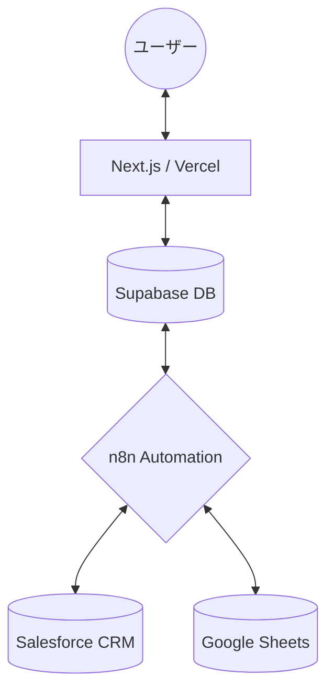

---

# **プロジェクト仕様書 - EI Student Platform (v1.1)**

## **1. プロジェクト概要**

### **1.1. プロジェクト名**
**EI Student Platform**（通称：生徒マイページ）

### **1.2. ビジョン**
イングリッシュイノベーションズの生徒が、日常的に利用するLINEを通じて**「自分の成長を実感し、あらゆる手続きをノンストレスで完結できる」**環境を構築する。

### **1.3. ミッション**
* **ゼロ・アドミ（事務ゼロ）の実現**: 休学・Vacation等の申請をセルフサービス化し、校舎スタッフの事務負担を劇的に削減する。
* **LTVの向上**: 学習進捗（出席率・スコア）を可視化し、生徒のモチベーション維持と継続率を高める。
* **データの一元化**: LINE、Supabase、Salesforceをシームレスに繋ぎ、常に最新の生徒情報を活用できる体制を作る。

---

## **2. コアコンセプトとターゲットユーザー**

### **2.1. コアコンセプト**
* **キーワード**: 「LINE完結」「ログイン不要」「リアルタイム」「パーソナライズ」
* **UX方針**: 「リッチメニューからのダイレクトアクセス」に最適化し、ナビゲーションを排除したロゴヘッダー中心のデザイン。スマートで直感的な操作を実現する。

### **2.2. ターゲットユーザー**
1. **既存生徒**: クラス出席、スコア確認、休学・Vacation申請を行いたい多忙な生徒。
2. **新規リード**: LINE登録直後で、説明会予約や事前アンケート回答を行いたい見込み客。
3. **校舎スタッフ**: 転記作業や確認メールの送信に追われている現場スタッフ。

---

## **3. 主要機能と画面仕様**

### **3.1. ステータス連動型ダッシュボード (UC-1)**
* **認証方式**: **LINEログイン (LIFF)** を採用。Salesforce項目 `bfml__LineId__c` と紐付け、ログインID/PASS入力を不要にする。
* **ディープリンク（直接リンク）対応**: 
  - `liff.login({ redirectUri: window.location.href })` を用いることで、リッチメニュー等から `/vacation` などの特定パスを直接指定して開くことが可能。
  - ログイン完了後も、ユーザーが最初に開こうとしたパスを正確に維持する。
* **動的表示（Status出し分け）**: Supabase上の `status` に応じてUIを「リード表示グループ」と「生徒表示グループ」の2パターンに自動切り替え。
  * **「生徒表示グループ」**: ポジポジ, 中途解約, 休学中, 卒業生
    * 表示内容: 出席率、目標スコア、受講コース（契約ステータス、現在の終了日含む）、各種申請ボタンを表示。
    * **テーマカラー**: 青/紫基調の落ち着いたデザイン。
  * **「リード表示グループ」**: 問い合わせ, 来校日程調整中, 来校日程セット済, リサイクル, 来校済, 見込生徒, 不成約
    * 表示内容: 説明会動画、来校予約導線、事前アンケートを表示。
    * **テーマカラー**: 緑基調のフレッシュなデザイン。

### **3.2. セルフサービス申請機能 (UC-2)**
* **対象**: 休暇(Vacation)申請、休学申請、事前アンケート/カウンセリング。
* **UX方針**:
  * 独立した個別ページ。LINEリッチメニューからの**ダイレクトリンク**に完全対応。
  * 申請完了後の **/success ページ（サンクスページ）** の実装。LIFF SDKを用いた `liff.closeWindow()` による自動クローズ機能。
* **主要ロジック（SB判定）**:
  * **School Break (SB) の自動判定**: `school_breaks` テーブルを参照。期間内にSBが含まれる場合、実質的な休暇週数から除外し、受講期間を正確に延長計算。
  * **Salesforce ID連携**: `student_sf_id` と `contract_course_sf_id` をキーに、Salesforce側での後続処理を自動化。
* **主要ルート**:
  * `/vacation`: **Vacation申請**（最大3週間まで。受講期間の自動延長計算あり）
  * `/leave`: **休学申請**（4週間以上。支払い方法選択機能あり）
  * `/counseling-form`: **事前アンケート**（DB駆動の動的入力フィールド）

### **3.3. 教材・学習管理機能 (UC-3)**
* **教材アクセス**: 受講コースに紐づいた音源データやPDF資料をLINE上から直接ダウンロード可能にする（Phase 3予定）。
* **進捗可視化**: Salesforceから同期された最新の出席状況やスコアを表示。

---

## **4. システムアーキテクチャ**

### **4.1. 全体構成**
Next.jsをフロントエンド、SupabaseをハブDBとし、n8nを用いてSalesforceおよびGoogle Sheetsと双方向連携を行う。

### **4.2. 技術スタック**
* **Frontend**: Next.js (App Router), Tailwind CSS, shadcn/ui
* **Backend/DB**: Supabase (PostgreSQL, Auth, RLS)
* **Automation**: n8n (iPaaS)
* **Master DB**: Salesforce (DX-LINE連携済)

---

## **5. データ連携・セキュリティ仕様**

### **5.1. 同期キー (Unique Key)**
* **LINE User ID (`line_id`)**: システム全体のユニークキー。
* **Salesforce ID (`sf_id`)**: オブジェクトレベルでの正確な紐付け用。

### **5.2. セキュリティ**
* **RLS (Row Level Security)**: Supabaseのポリシーを用い、ユーザーが自身の `line_id` に関連するデータのみを操作できるよう制限。
* **メタデータ・SEO (OGP)**:
  - 各ページに最適化されたタイトルと説明文を設定。
  - LINEトーク画面でのリンク共有時、各機能に応じた適切な日本語のプレビュー（OGP）を表示。
  - ページ構成をサーバーコンポーネント化し、静的メタデータによる確実な反映を実現。
* **環境変数**: APIキー、URL等は Vercel 上で厳格に管理。

---

## **6. 進捗ステータスと計画**

* **Phase 1: 基盤構築 (完了)**
  * Next.js + Supabase 環境構築、LIFF認証、ダッシュボードMVP。
* **Phase 2: ビジネスロジック実装 (完了)**
  * Vacation/休学申請の高度化、SB自動計算ロジック、Salesforce ID連携の確立。
* **Phase 3: 運用・拡張 (現在進行中)**
  * 本格デプロイ、教材ダウンロード機能、Messaging APIによる自動通知、プッシュ通知統合。

---
